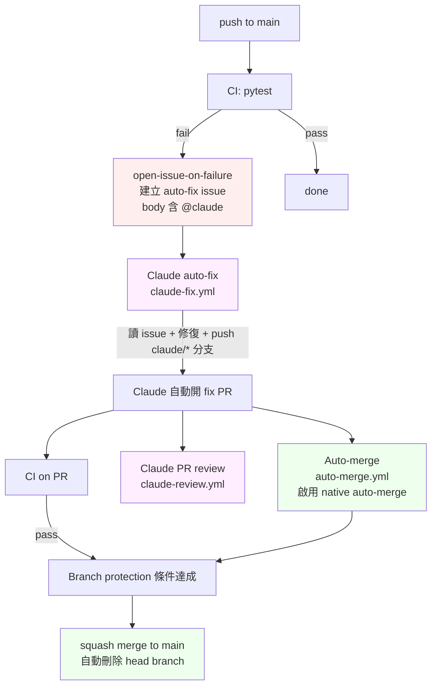

# gs-auto-fix

GitHub Actions 自動化流水線：CI 失敗 → 自動開 issue → Claude 修復並開 PR → Claude review → auto-merge。

## 目前已跑通的流程

四段式 auto loop，全程不需要人介入：



也支援手動觸發：在任何 issue/PR 留言 `@claude ...`（須為 OWNER/MEMBER/COLLABORATOR），Claude 會接手處理。

## 必備工具與帳號

**本地端**
- `git`
- Python 3.12+
- `gh` CLI（已 `gh auth login`）
- Claude Code CLI（Pro / Max / Team 訂閱版皆可）

**GitHub 端**
- 一個 GitHub 帳號
- Repo 必須是 **public**，或 owner 持有 Pro/Team plan（GitHub Free 的私人 repo 不支援 auto-merge）

**Claude 端**
- Claude Pro / Max / Team 訂閱（OAuth token 走訂閱配額，不收 API per-token 費用）

## 從零開始設定

### 1. 建立本地 repo + remote

```bash
git init -b main
gh repo create <repo-name> --public --source=. --remote=origin
```

### 2. 加入專案骨架

最少需要：

```
.github/workflows/ci.yml
.github/workflows/claude-fix.yml
.github/workflows/claude-review.yml
.github/workflows/auto-merge.yml
requirements.txt
tests/test_smoke.py
```

首次 push：

```bash
git add . && git commit -m "Initial scaffold" && git push -u origin main
```

### 3. 安裝 Claude Code GitHub App + 寫入 OAuth secret

在本機 Claude Code session 內執行：

```
/install-github-app
```

它會：
- 引導你裝 GitHub App
- 產生 OAuth token
- 自動把 `CLAUDE_CODE_OAUTH_TOKEN` 寫進 repo secrets

驗證：

```bash
gh secret list
# 應看到 CLAUDE_CODE_OAUTH_TOKEN
```

### 4. Repo settings（可用 gh CLI 一次套）

```bash
OWNER_REPO=<owner>/<repo>

# 啟用 auto-merge（repo 須為 public 或 owner 有 Pro 以上）
gh api -X PATCH repos/$OWNER_REPO -F allow_auto_merge=true -F delete_branch_on_merge=true --silent

# Workflow 寫入權限 + 允許 Actions 建立/批准 PR
gh api -X PUT repos/$OWNER_REPO/actions/permissions/workflow \
    -F default_workflow_permissions=write \
    -F can_approve_pull_request_reviews=true --silent

# Branch protection on main：要求 CI test job 通過、PR 才能合
cat <<'EOF' | gh api -X PUT repos/$OWNER_REPO/branches/main/protection --input -
{
  "required_status_checks": { "strict": false, "contexts": ["test"] },
  "enforce_admins": false,
  "required_pull_request_reviews": {
    "required_approving_review_count": 0,
    "dismiss_stale_reviews": false,
    "require_code_owner_reviews": false
  },
  "restrictions": null,
  "allow_force_pushes": false,
  "allow_deletions": false
}
EOF
```

### 5. 建立 labels

```bash
gh label create auto-fix   --color D93F0B --description "Triggered for Claude auto-fix"
gh label create ci-failure --color B60205 --description "CI failure on main"
gh label create auto-merge --color FBCA04 --description "Auto-merge once CI passes"
```

## 各 workflow 職責

| 檔案 | 觸發 | 職責 |
|---|---|---|
| `ci.yml` | push, pull_request | 跑 pytest；若是 main 失敗，呼叫 `open-issue-on-failure` job 建立 issue（label: `auto-fix`, `ci-failure`） |
| `claude-fix.yml` | issues (opened/labeled), issue_comment, pull_request_review_comment | 收到 `auto-fix` label 或受信任成員的 `@claude` 提及，呼叫 `claude-code-action@v1` 讀 issue/comment、修復、開 `claude/...` PR |
| `claude-review.yml` | pull_request (opened/synchronize/reopened/ready_for_review) | 對非 draft PR 執行 Claude review，找出 bugs/security/correctness，post 為 PR review comment |
| `auto-merge.yml` | pull_request (opened/labeled/...) | 若 head branch 為 `claude/*` 或 PR 帶 `auto-merge` label，呼叫 `peter-evans/enable-pull-request-automerge@v3` 啟用 native auto-merge（squash） |

## 如何觸發

**自動修復 CI 失敗** — 不用做事，push 壞掉的程式碼到 main 就會啟動。

**手動請 Claude 修某個 issue**：在 issue 上加 `auto-fix` label，或留言 `@claude please fix ...`（須 OWNER/MEMBER/COLLABORATOR）。

**讓 PR 自動 merge**：把 PR 標上 `auto-merge` label，或從 `claude/...` 分支開 PR。

## 驗證流程是否運作（smoke test）

```bash
# 1. 開新 branch、加個無關緊要的 passing test
git checkout -b smoke-test
echo 'def test_pass(): assert True' > tests/test_extra.py
git add . && git commit -m "Smoke test" && git push -u origin smoke-test

# 2. 開 PR，加 auto-merge label
gh pr create --fill
gh api -X POST repos/<owner>/<repo>/issues/<n>/labels -f labels[]=auto-merge

# 3. 等三件事
#    - CI 通過
#    - claude-review 留下 review 評論
#    - PR 自動 merge
```

驗證 main 失敗 loop：在 `tests/test_smoke.py` 改一個 assertion 讓它必失敗，push 到 main，看 issue 是否被自動建立、Claude 是否開 fix PR。

## 已知問題與待解決事項

### Medium severity — 尚未修復
**`claude-fix.yml` 的 `auto-fix` label 觸發路徑沒有 author_association 守門。**

label 控制的是「誰能加 label」，不是「issue body 內容」。攻擊者可以開一個帶惡意 prompt 的 issue，等任何 collaborator（或 CI bot）誤貼 label，Claude 就會讀那個 body 並有 `contents:write`。

**Mitigation 方向**：在 label 路徑加 `&& contains(fromJson('["OWNER","MEMBER","COLLABORATOR"]'), github.event.issue.author_association)`，並把 CI bot 設為 collaborator 讓自動 issue 仍能匹配；或更嚴格地檢查 `github.event.issue.user.login == 'github-actions[bot]'`。

### Low severity — 尚未修復
**並發觸發**：同一個 issue 若被 collaborator 開（含 @claude），又被加 `auto-fix` label，`opened` 與 `labeled` 兩個 trigger 都會跑，產生兩個並行的 Claude run。

**Mitigation**：在 `claude-fix.yml` 加 concurrency group：

```yaml
concurrency:
  group: claude-fix-${{ github.event.issue.number }}
  cancel-in-progress: false
```

### 設計取捨 — 故意保留
**Auto-merge 不等 claude-review 完成。** Branch protection 只把 CI 的 `test` job 列為必要 check，所以 claude-review 是「事後評論」，不會擋 merge。

要改成「review 必須完成」才能合，可：
1. 把 `Claude PR review` job 名稱列入 required status checks
2. 或在 `claude-review.yml` 失敗時用非零 exit code 阻擋

但要注意：claude-review 偶爾會被訂閱配額限制或網路抖動拖延，列為必要 check 會讓某些合理的 PR 卡住。

### 訂閱配額限制
- Claude Pro：~45 訊息 / 5h
- Max 5×：~225 / 5h
- Max 20×：~900 / 5h
- 同一個 5h 視窗內若 fix + review 太密集會被 rate limit；目前無自動退避機制

### 沒做的部分
- PR-Agent 之類的第三方 review tool（先前評估後改用 claude-code-action 自家做 review，避免另外付 OpenAI/PR-Agent 訂閱費）
- 更嚴格的 prompt injection 防護（限制 Claude 可用的 tool、加入 allowlist 等）
- Stale fix PR 自動關閉（Claude 開了 PR 但 CI 一直紅、人沒處理時的 GC）
- 通知整合（Slack / email），目前都靠 GitHub 原生通知
